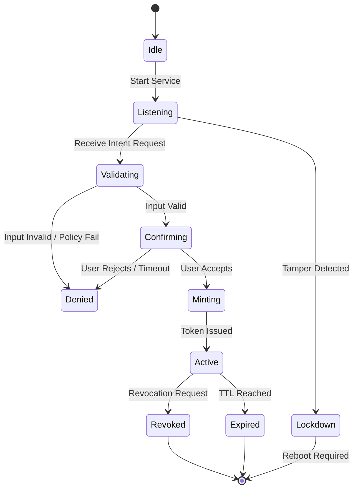
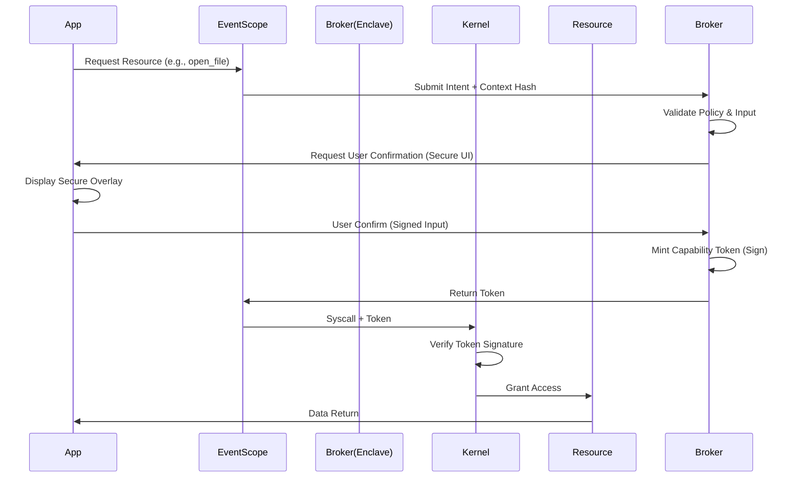

# Intent Broker Protocol Specification (IBP-1.0)
## Universal Computing Security Substrate (UCCS)
### Classification: Public Architecture Specification
### Date: October 2025
### Status: Draft Standard

---

## 1.0 Overview and Scope

The Intent Broker Protocol (IBP) defines the secure communication and execution logic between a user's verified intent and the capability enforcement engine within the IntentKernel architecture. It is the semantic translation layer that converts human action into cryptographic authority.

This specification applies to:
*   **Native IntentKernel Microkernel** (Native Mode)
*   **IntentKernel Relief Layer (IKRL)** (Compatibility Mode)
*   **Embedded/Industrial Controllers** (Constrained Mode)

The Broker is the **only** component authorized to mint capability tokens. All other system components must validate tokens issued by the Broker.

---

## 2.0 Architectural Boundaries and Trust Zones

To ensure structural immunity, the Broker is split across three trust boundaries. No single component holds complete authority.

| Component | Trust Zone | Responsibility | Security Requirement |
| :--- | :--- | :--- | :--- |
| **Intent Parser** | Userspace (Untrusted) | Collects raw input events (clicks, voice, API calls) | Integrity Checked, No Authority |
| **Secure UI Path** | Hardware/Display Controller | Renders confirmation prompts | Cannot be spoofed by OS |
| **Broker Core** | **TEE / Enclave** (SGX, TrustZone, VBS) | **Logic, Crypto, Token Minting** | **Isolated from Host OS** |
| **Policy Store** | Userspace (Signed) | Defines rules (e.g., "Max 5MB upload") | Cryptographically Signed |
| **Capability Engine** | Microkernel / LSM | Enforces tokens | Validates Broker Signature |

> **Critical Constraint:** The Host OS (Windows/Linux Kernel) cannot read the memory of the Broker Core. It can only send requests and receive signed tokens.

---

## 3.0 Intent Event Classification Pipeline

The Broker classifies incoming requests into three intent classes. Each class triggers different validation rules.

### 3.1 Class A: Direct User Intent
*   **Source:** Secure Input Path (Hardware Keyboard, Touch, Biometric).
*   **Example:** User clicks "Send" button.
*   **Validation:** Input signature verified against hardware root of trust.
*   **Token Strength:** High (Longer TTL, Higher Resource Limit).

### 3.2 Class B: Derived System Intent
*   **Source:** System Event triggered by user action.
*   **Example:** App auto-saves after user types.
*   **Validation:** Must trace back to a recent Class A event (Causal Chain).
*   **Token Strength:** Medium (Short TTL, Strict Resource Limit).

### 3.3 Class C: Background Lease Intent
*   **Source:** Scheduler / Heartbeat.
*   **Example:** Email sync, Vehicle telemetry.
*   **Validation:** Requires pre-approved policy + User renewal consent.
*   **Token Strength:** Low (Very Short TTL, Fixed Budget).

---

## 4.0 Secure Input Path Validation

To prevent "UI Redressing" or "Tapjacking," the Broker validates the input chain.

1.  **Input Event:** Hardware generates interrupt with signature `H_sig`.
2.  **Compositor:** Secure Compositor overlays the Broker UI prompt.
3.  **Coordinate Verification:** Broker verifies click coordinates match the visible button bounding box in the Secure Compositor.
4.  **Temporal Bound:** Input must occur within 500ms of prompt render.

**Failure Condition:** If the OS attempts to inject input events (synthetic clicks), the Hardware Signature will be missing, and the Broker will reject the intent.

---

## 5.0 Actor Identity and Context Hash Construction

Every capability token is bound to a specific context to prevent token theft or replay.

### 5.1 Actor Identity
*   **App ID:** Cryptographic hash of the application binary.
*   **User ID:** Hash of the current authenticated session.
*   **Device ID:** Hardware-bound unique identifier (TPM/Secure Enclave).

### 5.2 Context Hash Construction
The Broker constructs a context hash `H_ctx` used to sign the token:
```text
H_ctx = SHA3-256( App_ID || User_ID || Device_ID || Timestamp || Resource_ID )
```
*   **Resource_ID:** Specific object being accessed (e.g., `/dev/camera0`, `192.168.1.1:443`).
*   **Timestamp:** Prevents replay attacks outside the TTL window.

---

## 6.0 Capability Generation Rules

### 6.1 Token Scope Derivation
Tokens are not generic. They are scoped to the exact action.
*   **File Access:** Scope = `{ inode_id, access_mode (R/W), byte_range }`
*   **Network:** Scope = `{ dest_ip, dest_port, protocol, max_bytes }`
*   **Hardware:** Scope = `{ device_reg_addr, write_mask, max_cycles }`

### 6.2 Capability TTL Selection Logic
TTL is dynamic based on Risk Level.

| Risk Level | Context | TTL | Renewal |
| :--- | :--- | :--- | :--- |
| **Low** | Read local config | 5 seconds | None |
| **Medium** | Network Request | 30 seconds | None |
| **High** | File Write / Camera | 10 seconds | User Confirm |
| **Critical** | Vehicle Actuator | 100 milliseconds | Hardware Loop |

### 6.3 Delegation Rules
*   **Default:** Capabilities are non-transferable.
*   **Exception:** A process may delegate a capability to a child process ONLY if:
    1.  The child binary is signed by the same authority.
    2.  The delegation is explicitly requested via `delegate_capability()` API.
    3.  The delegated token has a shorter TTL than the parent.

---

## 7.0 Token Wire Format (RFC Draft)

Tokens are binary encoded (CBOR) for efficiency across IoT and High-Performance contexts.

```cbor
{
  "ver": 1,                  // Protocol Version
  "typ": "capability",       // Token Type
  "alg": "Dilithium5",       // Signature Algorithm (Post-Quantum)
  "kid": "broker_key_id",    // Key ID for Verification
  "ctx": "base64(H_ctx)",    // Context Hash
  "scope": {                 // Resource Scope
    "res": "network.tcp",
    "dst": "10.0.0.1:443",
    "lim": 1048576           // Bytes
  },
  "exp": 1698775200,         // Expiration (Unix Epoch ms)
  "uses": 1,                 // Max Uses (0 = unlimited within TTL)
  "sig": "base64(signature)" // Broker Signature
}
```
*   **Size:** Approx 512 bytes (including Post-Quantum signature).
*   **Verification:** Public key for `kid` is baked into the Capability Engine (Kernel/LSM).

---

## 8.0 Lifecycle Management

### 8.1 Background Lease Issuance Logic
Background processes do not hold tokens. They hold **Leases**.
1.  Process requests Lease `L`.
2.  Broker grants `L` with duration `T` (e.g., 30s).
3.  Process must present `L` to renew.
4.  If Process fails to renew within `T`, Kernel suspends process.
5.  **User Visibility:** All active leases are visible in the Secure UI.

### 8.2 Revocation Propagation Rules
*   **Immediate:** Broker adds Token ID to Revocation List (CRL).
*   **Distribution:** CRL pushed to all Capability Engines via secure channel.
*   **Enforcement:** Kernel checks CRL on every token validation.
*   **Latency:** Target < 100ms for critical revocation (e.g., lost device).

### 8.3 Cross-Device Federation Logic
For distributed tasks (e.g., Phone casting to TV):
1.  Device A (Phone) requests capability from Broker A.
2.  Broker A federates with Broker B (TV) via secure channel.
3.  Broker B mints a **Derived Token** valid only on Device B.
4.  Device A sends Derived Token to Device B.
5.  Device B validates token against Broker B.

---

## 9.0 Secure UI Confirmation Channel

The Broker UI bypasses the host OS graphics stack.

*   **Implementation:** Uses Hardware Overlay Plane (Windows MPO, Linux Overlay Plane).
*   **Visibility:** Always on top, cannot be obscured.
*   **Input:** Accepts input only from Secure Input Path (see Section 4.0).
*   **Content:** Displays Resource Name, App Name, Action, and Risk Level.
*   **Timeout:** Auto-denies after 10 seconds of inactivity to prevent "click fatigue" attacks.

---

## 10.0 Tamper Detection and Policy Overrides

### 10.1 Tamper Detection
*   **Memory Integrity:** Enclave regularly checks its own memory integrity.
*   **Input Integrity:** If input signature is invalid, Broker enters **Lockdown Mode**.
*   **Lockdown Mode:** All token issuance halts. Only emergency revoke commands accepted. Requires physical reboot to clear.

### 10.2 Policy Override Conditions
*   **Emergency Override:** Physical button combination (e.g., Vol+ + Power) grants a temporary "Admin Lease" for recovery.
*   **Audit Override:** Security auditors can issue "Read-Only Monitor Tokens" to observe system state without modifying it.
*   **Legal Override:** None. The architecture does not support backdoors. If the key is lost, the data is lost.

---

## 11.0 Formal Threat Model for the Broker

| Threat Actor | Capability | Mitigation |
| :--- | :--- | :--- |
| **Malicious App** | Try to forge token | Cryptographic Signature (Dilithium) |
| **Compromised OS** | Try to steal token from memory | Token Encrypted in Enclave; Ephemeral |
| **Network Attacker** | Try to replay token | Context Hash includes Timestamp + Nonce |
| **Physical Attacker** | Try to probe enclave | Hardware Tamper Resistance (TEE) |
| **User Error** | Accidentally grant access | Secure UI shows clear risk; Auto-expiry |
| **Insider Admin** | Try to bypass policy | Policy Signed by External Authority; Audit Log |

---

## 12.0 State Machine Diagram



---

## 13.0 Token Issuance Sequence Diagram



---

## 14.0 Example Flows

### 14.1 File Open (Desktop)
1.  **App:** Calls `fopen("secret.docx")`.
2.  **Broker:** Pauses call. Shows Secure UI: "App X wants to read secret.docx".
3.  **User:** Clicks "Allow Once".
4.  **Token:** Issued with Scope `{ inode: 12345, access: READ, bytes: ALL }`, TTL 5s.
5.  **Kernel:** Validates token, allows open. Subsequent reads without token fail.

### 14.2 Camera Capture (Mobile)
1.  **App:** Calls `camera.takePhoto()`.
2.  **Broker:** Checks if lens cover is physically open (Sensor fusion).
3.  **User:** Shutter button press (Secure Input).
4.  **Token:** Issued with Scope `{ device: camera0, action: capture, count: 1 }`.
5.  **Kernel:** Enables camera sensor for 2 seconds only.

### 14.3 Network Request (Server)
1.  **App:** Calls `socket.connect("api.example.com")`.
2.  **Broker:** Checks Domain Allowlist Policy.
3.  **Token:** Issued with Scope `{ ip: resolved_ip, port: 443, protocol: TLS }`.
4.  **Kernel:** Allows packet egress only to that IP/Port.

### 14.4 Cloud Service Invocation (Distributed)
1.  **Local App:** Requests cloud function execution.
2.  **Broker:** Mints token valid for Cloud Endpoint ID.
3.  **Network:** Token sent via Post-Quantum TLS.
4.  **Cloud Broker:** Validates token signature against Local Broker Public Key (Federated Trust).
5.  **Cloud Function:** Executes only if token valid.

### 14.5 Vehicle Control Message (Automotive)
1.  **Controller:** Requests "Brake Adjust".
2.  **Broker:** Checks Safety Policy (Max deceleration limit).
3.  **Token:** Issued with TTL 100ms.
4.  **Actuator:** Executes command.
5.  **Safety:** If token expires mid-command, actuator defaults to safe state.

### 14.6 Industrial Actuator Command (PLC)
1.  **SCADA:** Sends "Open Valve" command.
2.  **Broker:** Verifies Operator Badge Swipe (Physical MFA).
3.  **Token:** Issued with Scope `{ valve_id: 5, state: OPEN }`.
4.  **PLC:** Executes.
5.  **Audit:** Command + Token ID logged to Immutable Ledger.

---

## 15.0 Implementation Roadmap

To move from Vision to Platform, the following three artifacts must be built immediately:

1.  **Intent Broker Protocol Spec (This Document):** Defines the logic.
2.  **Capability Token Wire Format RFC:** Defines the binary structure and crypto suites.
3.  **Event-Scope Scheduling Model Spec:** Defines how leases interact with the OS scheduler.

### Phase 1: Reference Implementation (Months 1-6)
*   Build `intentd` for Linux (Userspace + SGX).
*   Implement `eventscope` library for C/Python.
*   Demonstrate File Open and Network flows.

### Phase 2: IKRL Integration (Months 7-12)
*   Port Broker to Windows VBS.
*   Integrate with Android Binder.
*   Deploy to pilot enterprise fleet.

### Phase 3: Native Silicon (Year 2+)
*   Collaborate with SoC vendors to hardwire Broker logic into silicon.
*   Remove userspace overhead.

---

## 16.0 Conclusion

The Intent Broker Protocol is the semantic key that unlocks the IntentKernel architecture. By formally defining how human intent is translated into cryptographic authority, we remove the ambiguity that allows malware to persist.

This specification transforms IntentKernel from a theoretical OS design into a deployable security substrate. It allows us to enter the market not as a replacement, but as an upgrade—running on top of Windows, Linux, and Android today, while paving the way for the native hardware of tomorrow.

**End of Specification IBP-1.0**