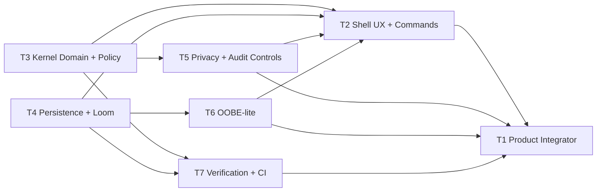

# Intent Kernel AI OS — Product Requirements (Initial Engineering Baseline)

## 0. Purpose and framing
This document translates the current user vision ("Liquid Obsidian", Field, Threshold, Intent Cards, Kernel Bar, Loom, cross-platform OOBE replacement, privacy-by-default) into buildable requirements for the current repository state.

It is scoped to what can be delivered first using the existing Rust `intentos` runtime (`intentos-shell`, `intentos-kernel`, `intentos-utilities`) plus minimal new code.

---

## 1) Product goals

### G1. Replace permission prompts with intent-scoped actions
Deliver a UI/CLI flow where users perform actions through **Intent Cards** and receive narrowly scoped capability grants, instead of persistent permissions.

### G2. Introduce a consistent interaction model
Implement **Kernel Bar** as the primary action surface and **Field** as the current context/workspace where intents are assembled, executed, and audited.

### G3. Enforce risk gating through Threshold
Add a **Threshold** policy layer that blocks, requires confirmation, or allows intents based on trust signals and requested capability scope.

### G4. Ship privacy-by-default behavior
No telemetry by default, no ambient access, explicit consent for any persistent data export, and visible audit of all grants/revocations.

### G5. Establish migration path via Loom
Define **Loom** as cross-device/session continuity for intent state and policy profiles, beginning with local-only sync in MVP and federation later.

### G6. Start cross-platform OOBE replacement
Provide a minimal, platform-neutral onboarding flow (OOBE replacement) that initializes identity keys, policy defaults, and user trust settings without OS-level replacement.

---

## 2) Scope: MVP vs later phases

## 2.1 MVP (initial repo sprint: 2–4 weeks)
Build on existing in-process runtime; no claim of OS replacement.

### Included
1. **Domain model and terminology**
   - Add first-class structs/enums for: `Field`, `Threshold`, `IntentCard`, `KernelBarCommand`, `LoomSession`.
2. **Kernel Bar command surface in shell**
   - New shell commands: `kb open`, `kb suggest`, `kb run <card_id>`, `kb status`.
3. **Intent Cards lifecycle**
   - Create card, preview capability request, user confirm/deny, execute, record audit entry.
4. **Threshold policy checks**
   - Threshold levels `low|medium|high` mapped to capability risk rules in `intentos-kernel` policy path.
5. **Field context management**
   - `field create/use/list` commands; cards execute within active field context.
6. **Privacy-by-default baseline**
   - Telemetry disabled by default.
   - AI utility disabled unless explicit per-session enable.
   - Audit log local-only by default.
7. **OOBE-lite flow**
   - First-run wizard in shell: create local profile, generate signing keypair, set default threshold.
8. **Loom local continuity (phase-0)**
   - Persist field + card metadata locally and restore on restart.

### Excluded
- Native desktop/mobile GUI.
- Real cross-device sync.
- Production PQC migration in `intentos-*` path.
- OS-level syscall interception boundary.

## 2.2 Phase 1 (post-MVP)
- TUI/desktop UI for Kernel Bar and cards.
- Signed Loom exports/imports between machines.
- Rich Threshold signals (device posture, biometrics, hardware trust).
- Policy packs per environment (personal/enterprise).

## 2.3 Phase 2+
- Full cross-platform OOBE integration hooks (Windows/Linux/macOS bootstrap installers).
- Remote Intent Broker federation.
- PQC token path in active runtime.
- Multi-tenant governance and admin APIs.

---

## 3) Functional requirements with acceptance criteria

## FR-01: Kernel Bar command interface
**Requirement:** System shall expose a unified Kernel Bar interface via shell commands for discovery and execution of Intent Cards.

**Acceptance criteria:**
- `kb open` shows current Field and available cards.
- `kb suggest` returns at least 3 card suggestions based on recent commands/history.
- `kb run <card_id>` triggers policy evaluation before execution.
- Unit tests cover success + denied execution path.

## FR-02: Intent Card schema and storage
**Requirement:** System shall represent each intent as a typed card with explicit requested capability scope.

**Acceptance criteria:**
- Card schema includes: `id`, `title`, `field_id`, `requested_caps`, `ttl`, `uses`, `risk_level`, `created_at`.
- Cards can be persisted and reloaded across process restart.
- Invalid card (missing caps or ttl) is rejected with deterministic error.

## FR-03: Field context isolation
**Requirement:** System shall execute cards in an active Field context to avoid unintended cross-context authority.

**Acceptance criteria:**
- `field use <id>` sets active context.
- Card execution fails if card field != active field.
- Audit record includes `field_id` for every execution attempt.

## FR-04: Threshold policy gate
**Requirement:** System shall apply Threshold policy before token mint/handle registration.

**Acceptance criteria:**
- Threshold levels are configurable at profile + per-card override.
- High-risk cards require explicit confirmation step.
- Denied actions produce no token and no handle registration.
- Policy tests validate allow/confirm/deny transitions.

## FR-05: Confirmation UX for high-risk intents
**Requirement:** System shall require explicit confirmation for high-risk intents and show capability summary.

**Acceptance criteria:**
- Prompt includes resource, action, ttl, uses.
- If user declines, operation aborts with audit event `user_denied`.
- If user confirms, execution proceeds and records `user_confirmed`.

## FR-06: Privacy-by-default runtime mode
**Requirement:** System shall boot with privacy-protective defaults.

**Acceptance criteria:**
- Telemetry flag defaults to `off`.
- AI gateway inaccessible until `ai enable` command in active session.
- No network calls are performed by default startup path.
- Config file explicitly stores privacy defaults.

## FR-07: Local audit trail
**Requirement:** System shall persist append-only local audit events for card lifecycle and capability decisions.

**Acceptance criteria:**
- Events include: `timestamp`, `field_id`, `card_id`, `decision`, `reason`, `cap_summary`.
- File is append-only in normal operation.
- `audit tail` command prints last N events.

## FR-08: OOBE-lite first-run flow
**Requirement:** System shall provide first-run onboarding replacing ad-hoc setup with explicit profile + policy initialization.

**Acceptance criteria:**
- On first boot, wizard runs automatically.
- Wizard outputs: local profile id, generated key material, default threshold setting.
- Subsequent boots skip wizard unless `oobe reset` is run.

## FR-09: Loom local session continuity
**Requirement:** System shall restore prior user state (fields/cards/settings) on restart.

**Acceptance criteria:**
- Restart restores active field and card index.
- Corrupt Loom state file triggers safe fallback and warning.
- Round-trip tests verify persistence integrity.

## FR-10: Developer-operable test harness
**Requirement:** System shall include runnable tests for all new concepts in CI.

**Acceptance criteria:**
- `cargo test -p intentos` includes card/field/threshold/loom/oobe tests.
- At least one integration test validates end-to-end: create card -> threshold -> confirm -> token -> utility action.

---

## 4) Non-functional requirements

## NFR-01: Performance
- Policy + threshold decision latency: p95 < 15 ms in local runtime.
- Card list/load operations in CLI perceived as instant (< 100 ms for 500 cards).

## NFR-02: Reliability
- Loom local state must survive unclean process exit with no total data loss.
- Audit log writes must be crash-safe (flush on write or bounded buffering with recovery).

## NFR-03: Security baseline
- No ambient authority added for convenience paths.
- Token issuance continues to require policy allow decision.
- Sensitive local files (profile, keys, loom state) use OS-user permissions and non-world-readable defaults.

## NFR-04: Privacy
- Zero external telemetry by default.
- Explicit opt-in required for any outbound analytics or remote sync.
- Audit redaction mode available for sensitive resource names.

## NFR-05: Maintainability
- New modules documented with rustdoc.
- Public structs for card/field/threshold versioned for forward compatibility.
- No dependency on legacy IKRL daemon crates for MVP flow.

## NFR-06: Portability
- MVP runs on Windows and Linux with same command set.
- File path and persistence logic abstracted to avoid platform-specific behavior in core logic.

---

## 5) Risks and assumptions

## 5.1 Key assumptions
1. Current `intentos` in-process runtime is the implementation baseline.
2. MVP success means demonstrable intent-scoped UX and policy behavior, not OS replacement.
3. Users accept CLI-first interaction for first sprint.
4. Existing token/policy paths are stable enough for extension.

## 5.2 Major risks
1. **Terminology ambiguity risk** (Field/Threshold/Loom may be interpreted differently)
   - Mitigation: freeze glossary in code + docs before implementation.
2. **Scope inflation risk** (trying to deliver GUI/OOBE/cross-device sync at once)
   - Mitigation: enforce MVP exclusions and phase gates.
3. **Security overclaim risk**
   - Mitigation: keep README and release notes aligned with reference-implementation status.
4. **Persistence integrity risk** for Loom local state
   - Mitigation: atomic writes + checksum/versioning.
5. **UX friction risk** in confirmation prompts
   - Mitigation: keep confirmations only for high-risk threshold class.

## 5.3 Dependencies
- Existing `intentos-kernel` policy/token/lease components.
- `intentos-shell` command routing for new command group.
- `intentos-utilities` storage helpers (or new persistence helper crate/module).

---

## 6) Initial sprint backlog (implementation-ready)

1. Add domain types (`card.rs`, `field.rs`, `threshold.rs`, `loom.rs`) in `intentos-kernel` or shared module.
2. Add shell commands for `kb`, `field`, `audit`, `oobe`.
3. Implement local persistence adapter for cards/fields/settings.
4. Integrate threshold checks into policy evaluation path.
5. Add confirmation flow for high-risk cards.
6. Add append-only audit logger and `audit tail` command.
7. Add first-run OOBE-lite bootstrap and `oobe reset`.
8. Add integration and unit tests; wire into existing test suites.

**Sprint Definition of Done:** all FR-01..FR-10 acceptance criteria met in local CI; commands documented in `rust/README.md`; no regressions in existing `intentos` tests.

---

## 7) Multi-subagent development workstream model (implementation-focused)

This model is scoped to the active `intentos-*` runtime (`intentos`, `intentos-shell`, `intentos-kernel`, `intentos-utilities`) and near-term MVP delivery.

### 7.1 Track map (7 subagent tracks)

| Track | Primary ownership | Core repo surfaces | Deliverables |
|---|---|---|---|
| T1 Product Integrator & Release Orchestration | Staff engineer + release PM | `rust/crates/intentos/`, `rust/README.md`, CI wiring | Sprint integration branch, release checklist, acceptance traceability matrix for FR-01..FR-10 |
| T2 Shell UX & Command Surface | Shell/Rust engineer | `rust/crates/intentos-shell/src/` | `kb`, `field`, `audit`, `oobe` command routing; prompt/confirmation UX; command help text |
| T3 Kernel Domain + Policy/Threshold | Kernel/Rust engineer | `rust/crates/intentos-kernel/src/` | `Field`, `IntentCard`, `Threshold`, `LoomSession` types; threshold gate integration; deterministic policy outcomes |
| T4 Persistence, Loom, and State Recovery | Systems engineer | `rust/crates/intentos-utilities/src/`, shared storage helpers | Local persistence for cards/fields/settings; restart restore; corruption-safe fallback path |
| T5 Privacy, Audit, and Safety Controls | Security/privacy engineer | `intentos-audit`, `intentos-kernel`, `intentos-shell`, config path | Append-only audit trail; privacy defaults enforcement; redaction mode; policy/audit invariants |
| T6 OOBE-lite Bootstrap & Profile Lifecycle | Platform engineer | `intentos-shell`, profile/key bootstrap modules | First-run wizard; keypair generation flow; threshold default initialization; `oobe reset` |
| T7 Verification, CI, and Quality Gates | QA/SDET + tooling engineer | `rust/crates/intentos/tests/`, crate tests, workspace CI | Unit/integration tests for FR/NFR; performance checks (policy p95); regression gates in CI |

### 7.2 Dependency graph and parallelization plan

**Parallelization windows:**
1. **Wave A (start immediately):** T3, T4, T5 run in parallel with agreed interface contracts.
2. **Wave B (after first contract stubs):** T2 and T6 start against stable trait/API signatures and fixture data.
3. **Wave C (continuous):** T7 starts with contract tests early, then expands to end-to-end paths.
4. **Wave D (hardening/release):** T1 drives merge train, acceptance closure, and release artifacts.

### 7.3 Interface contracts between tracks

1. **Intent Card contract (T3 -> T2/T4/T7)**
   - Stable schema fields: `id`, `title`, `field_id`, `requested_caps`, `ttl`, `uses`, `risk_level`, `created_at`.
   - Serialization contract: versioned payload with explicit schema version.
   - Error contract: deterministic typed errors for invalid/missing fields.

2. **Policy decision contract (T3 -> T2/T5/T7)**
   - Decision enum: `allow | confirm | deny`.
   - Decision metadata: `reason_code`, `threshold_level`, `cap_summary`.
   - Guarantee: deny path mints no token and registers no handle.

3. **Persistence contract (T4 -> T2/T6/T7)**
   - Repository-like API for `field/card/profile/loom_state` with atomic write semantics.
   - Recovery behavior: checksum/version mismatch triggers safe fallback + warning event.
   - File permissions baseline exposed as helper for Windows/Linux parity.

4. **Audit event contract (T5 -> T2/T3/T7)**
   - Append-only event shape: `timestamp`, `field_id`, `card_id`, `decision`, `reason`, `cap_summary`, `event_type`.
   - Event types include `user_confirmed`, `user_denied`, policy allow/deny, persistence recovery warnings.

5. **OOBE bootstrap contract (T6 -> T2/T4/T7)**
   - First-run detector API.
   - Outputs: `profile_id`, key material references, default threshold, privacy defaults snapshot.
   - Reset semantics: `oobe reset` clears bootstrap marker and re-initializes profile.

### 7.4 Weekly operating cadence

- **Monday (Plan/Contract Lock, 45 min):**
  - Confirm sprint scope tied to FR IDs.
  - Freeze/approve interface changes for current week.
- **Daily (15 min async + 15 min sync):**
  - Track-level status using `done / next / blocked`.
  - Blocker SLA: unresolved blockers escalated to T1 within same day.
- **Wednesday (Integration checkpoint, 60 min):**
  - Merge contract-compatible slices into integration branch.
  - Run focused end-to-end path: create card -> threshold -> confirm -> token -> utility action.
- **Friday (Quality/release gate, 60 min):**
  - CI, regression, performance and privacy checks.
  - Accept/reject each FR completion with evidence links.

### 7.5 Quality gates and definition of done per track

| Track | Quality gates | Definition of done |
|---|---|---|
| T1 | All dependent tracks green in CI; FR traceability complete | Integrated build tagged; release notes + known limits updated |
| T2 | Command parsing tests, UX snapshot tests, denied/confirm paths validated | `kb/field/audit/oobe` commands stable and documented |
| T3 | Policy unit tests for allow/confirm/deny; token non-issuance on deny verified | Domain types + threshold enforcement merged with versioned API |
| T4 | Persistence round-trip tests; corruption recovery tests; path portability checks | State restores on restart with safe fallback behavior |
| T5 | Privacy default tests (telemetry off, AI gated); append-only audit validation | Audit/privacy controls enforced with no default network behavior |
| T6 | First-run and repeat-run tests; reset flow tests; key/profile bootstrap checks | OOBE-lite reliably initializes and can be reset deterministically |
| T7 | End-to-end integration tests; performance check for policy p95 target; regression suite | CI gates enforce FR-01..FR-10 and critical NFR baselines |

### 7.6 Risk controls to prevent divergence from vision

1. **Vision lock artifacts:** maintain a frozen glossary (`Field`, `Threshold`, `IntentCard`, `Kernel Bar`, `Loom`) and map every PR to FR/NFR IDs.
2. **Scope firewall:** reject PRs introducing GUI, remote sync, or OS-replacement claims in MVP branch unless phase gate approved.
3. **Truth-in-claims gate:** T1 + T5 must review README/docs changes for security/privacy overclaims before merge.
4. **Contract-first development:** incompatible interface changes require explicit version bump and migration notes.
5. **Evidence-based completion:** no FR marked done without test evidence in CI and command-level repro steps.
6. **Drift checks:** weekly architecture diff review between planned interfaces and merged code to detect ad-hoc divergence.
7. **Fallback safety:** persistence and policy changes must include failure-mode behavior (safe deny, safe restore) before release.

### 7.7 Handoff protocol (minimal, enforceable)

- Every handoff package includes:
  1. Interface signature/version
  2. Test fixtures and expected outputs
  3. Known edge cases
  4. Rollback plan
- Consumer track must acknowledge compatibility within one business day.
- Unacknowledged or breaking handoffs block merge-to-main until resolved.

---

## 8) Sprint 1 implementation plan (2 weeks, execution-ready)

### 8.1 Sprint goal
Deliver a CLI-first vertical slice of IntentOS primitives so a user can: initialize first-run profile defaults, create/use a Field, run an Intent Card through Threshold gating, receive explicit confirm/deny behavior for high-risk operations, and inspect local audit output after restart.

### 8.2 FR mapping for Sprint 1 scope

| Sprint-1 objective | FR coverage | In-sprint target |
|---|---|---|
| Kernel Bar command skeleton and execution path | FR-01 | `kb open/suggest/run/status` commands with policy pre-check and tests |
| Intent Card model + persistence | FR-02 | Typed schema, validation errors, local persist/reload |
| Field activation + isolation checks | FR-03 | `field create/use/list`; mismatch fail path audited |
| Threshold decision integration | FR-04 | `allow/confirm/deny` transitions in policy path before token mint |
| Confirmation UX for high-risk | FR-05 | Shell confirm prompt with capability summary + audit events |
| Privacy default boot profile | FR-06 | telemetry off default, AI disabled until session enable |
| Append-only local audit + tail command | FR-07 | append-only events and `audit tail <n>` behavior |
| OOBE-lite first run + reset | FR-08 | wizard run-once marker and deterministic reset |
| Loom local continuity baseline | FR-09 | restore active field/card index + corruption fallback |
| Test harness and CI path | FR-10 | unit + integration suite covering end-to-end slice |

### 8.3 Prioritized Sprint 1 backlog items (must ship)

1. Define `IntentCard`, `Field`, `ThresholdLevel`, `LoomSessionState` domain objects and serde schema version.
2. Add Threshold decision model (`allow|confirm|deny`) and integrate at kernel policy pre-mint path.
3. Add shell command group routing for `kb`, `field`, `audit tail`, `oobe`, `ai enable`.
4. Implement local persistence adapter for field/card/profile/loom files with atomic write + checksum.
5. Implement high-risk confirmation flow with explicit accept/decline and corresponding audit records.
6. Add OOBE-lite first-run bootstrap (profile id + key material reference + default threshold).
7. Add Loom restore-on-start and corruption-safe fallback warning path.
8. Add FR-traceable tests (unit + one integration flow) and wire into workspace CI command set.

### 8.4 Owner-by-track task breakdown (concrete)

| Track owner | Execution tasks this sprint | Output evidence |
|---|---|---|
| T1 Product Integrator | Maintain FR trace matrix, coordinate merge train, enforce scope firewall | Updated FR checklist + merged integration branch |
| T2 Shell UX/Commands | Implement command parsing/dispatch and confirmation prompts for `kb/field/audit/oobe/ai` | Command tests and example CLI transcripts |
| T3 Kernel Domain/Policy | Add domain types + threshold policy states, ensure deny path mints no token/registers no handle | Kernel unit tests for decision transitions |
| T4 Persistence/Loom | Build local state repositories, atomic writes, restart restore, corruption fallback | Round-trip + corruption recovery tests |
| T5 Privacy/Audit | Enforce privacy defaults, append-only events, event type coverage (`user_confirmed`,`user_denied`) | Privacy default tests + audit chain checks |
| T6 OOBE/Profile | Implement first-run detection, profile bootstrap, reset semantics | First-run/re-run/reset test outputs |
| T7 Verification/CI | Add integration test path and CI gate command for FR-01..FR-10 sprint subset | CI run artifacts and pass/fail thresholds |

### 8.5 Explicit crate and file touchpoints

**Primary implementation surfaces (existing files):**
- `rust/crates/intentos-shell/src/builtins.rs` (new command handlers and confirmation UX)
- `rust/crates/intentos-shell/src/parser.rs` (subcommand parsing extensions)
- `rust/crates/intentos-shell/src/session.rs` (startup hooks for OOBE/Loom restore)
- `rust/crates/intentos-kernel/src/policy.rs` (threshold decision evaluation path)
- `rust/crates/intentos-kernel/src/lib.rs` (new APIs for card/field/threshold execution entrypoints)
- `rust/crates/intentos-kernel/src/token.rs` (enforce confirm/deny semantics before mint)
- `rust/crates/intentos-kernel/src/table.rs` (guard registration for denied/unconfirmed decisions)
- `rust/crates/intentos-utilities/src/lib.rs` (runtime defaults and state service wiring)
- `rust/crates/intentos-utilities/src/ai.rs` (session-gated AI enablement)
- `rust/crates/intentos-audit/src/lib.rs` (event shape additions needed for card lifecycle)

**Likely new files/modules for Sprint 1:**
- `rust/crates/intentos-kernel/src/card.rs`
- `rust/crates/intentos-kernel/src/field.rs`
- `rust/crates/intentos-kernel/src/threshold.rs`
- `rust/crates/intentos-kernel/src/loom.rs`
- `rust/crates/intentos-utilities/src/state_store.rs`
- `rust/crates/intentos-shell/src/oobe.rs`

### 8.6 Sprint 1 test plan

1. **Kernel/domain unit tests**
   - Card validation rejects missing `requested_caps`/invalid TTL.
   - Threshold transitions return deterministic `allow|confirm|deny`.
   - Deny and unconfirmed high-risk paths produce no token and no handle registration.
2. **Shell command tests**
   - `kb open/suggest/status/run` parse and route correctly.
   - `field create/use/list` updates active field and blocks cross-field card run.
   - `oobe reset` resets marker and re-triggers bootstrap path.
3. **Persistence tests**
   - Field/card/profile/loom round-trip survives process restart.
   - Corrupt loom file causes safe fallback + warning event.
   - Audit log remains append-only and chain-valid.
4. **Integration (minimum one required)**
   - `create card -> threshold confirm -> user confirm -> token mint -> utility action -> audit tail`.
5. **Performance/guard checks**
   - Policy decision p95 under 15 ms in local test harness.
   - Startup path performs no network calls when privacy defaults are untouched.

### 8.7 Day-by-day timeline (10 working days)

| Day | Planned execution | Primary owner(s) | Exit signal |
|---|---|---|---|
| Day 1 (Mon W1) | Lock contracts for card/field/threshold/loom types; freeze Sprint-1 FR scope | T1, T3, T4 | Interface signatures approved |
| Day 2 | Implement kernel domain structs + serialization versioning | T3 | Domain compile/tests green |
| Day 3 | Add threshold `allow/confirm/deny` policy path and pre-mint checks | T3, T5 | Policy transition tests pass |
| Day 4 | Implement persistence repositories and checksum/atomic write baseline | T4 | Round-trip tests pass |
| Day 5 | Wire shell commands (`kb`, `field`, `audit tail`) to new APIs | T2 | Command routing tests pass |
| Day 6 (Mon W2) | Add high-risk confirmation UX and audit event emission | T2, T5 | Confirm/deny flow tested |
| Day 7 | Implement OOBE-lite first-run + reset + privacy defaults wiring | T6, T2, T5 | First-run/reset tests pass |
| Day 8 | Implement Loom restore + corruption fallback warning behavior | T4, T6 | Recovery tests pass |
| Day 9 | Add end-to-end integration tests and CI gate wiring | T7, T1 | Integration pipeline green |
| Day 10 (Fri W2) | Hardening, bugfixes, FR evidence review, release readiness decision | T1, all tracks | Sprint exit criteria met or explicit carryover list |

### 8.8 Sprint 1 exit criteria

Sprint 1 is complete only if all conditions are true:
1. FR-01..FR-10 have at least one passing automated test mapped in CI.
2. `kb`, `field`, `audit tail`, `oobe`, and `ai enable` commands execute in local runtime without regressions.
3. High-risk intent path requires explicit user confirmation and records confirmation outcome.
4. Denied/unconfirmed intents produce no token and no capability handle registration.
5. Restart restores active field/card index from local Loom state; corrupt state triggers safe fallback.
6. Privacy defaults are active (`telemetry=off`, `AI disabled until enabled`) and no default startup network calls occur.

### 8.9 Rollback and risk controls for Sprint 1

- **Feature flag rollback:** gate new command surfaces and threshold confirm path behind `INTENTOS_SPRINT1=1`; fallback to prior behavior when disabled.
- **Safe policy fallback:** on threshold evaluator failure, default to `deny` with auditable reason code.
- **Persistence rollback:** keep previous state file as `.bak` before write; on checksum mismatch restore last known good file.
- **Merge gating:** block merge when FR trace ID or tests are missing.
- **Scope containment:** defer GUI, cross-device Loom sync, and OS-replacement claims to post-sprint phases.
- **Operational risk review:** daily blocker escalation to T1; unresolved security/privacy blockers stop release cut.
