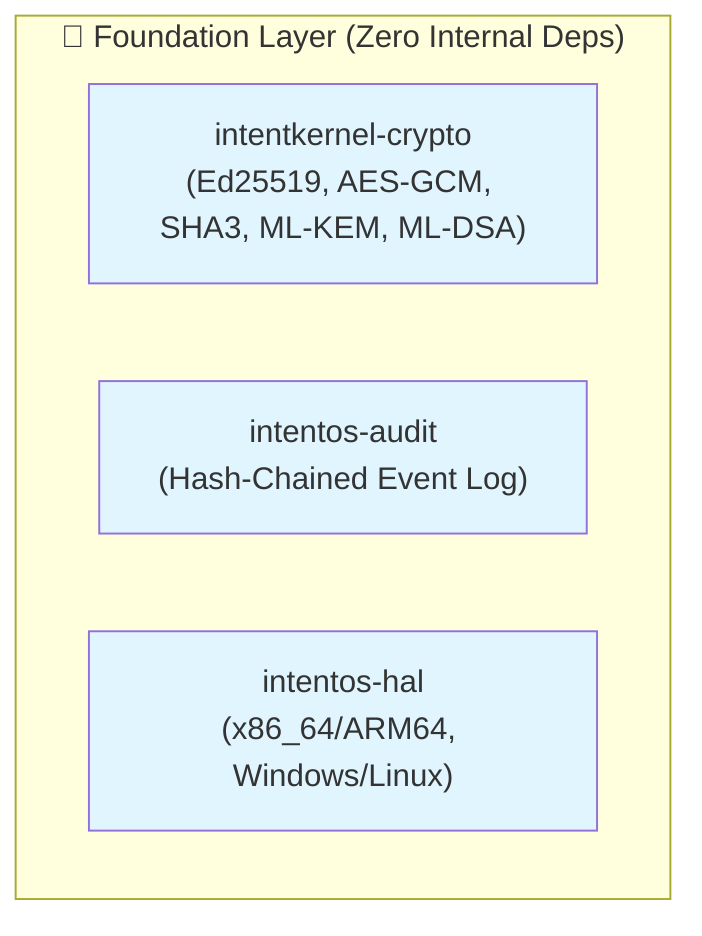
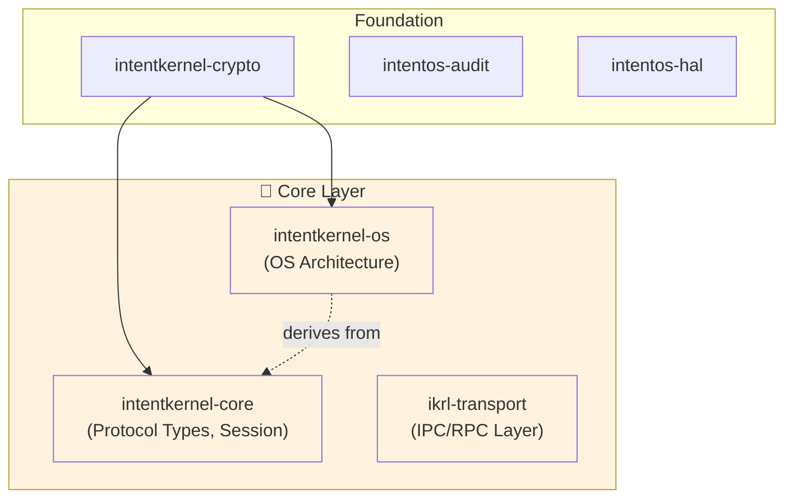
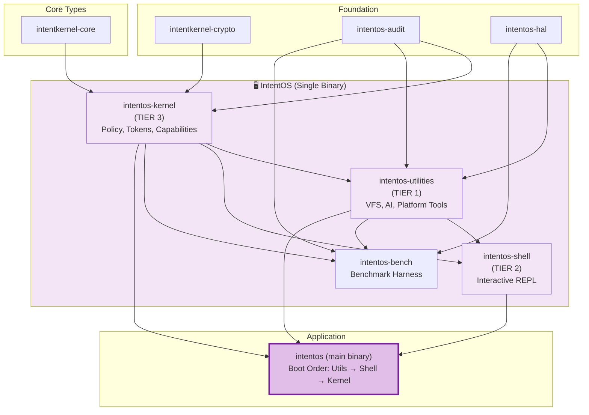
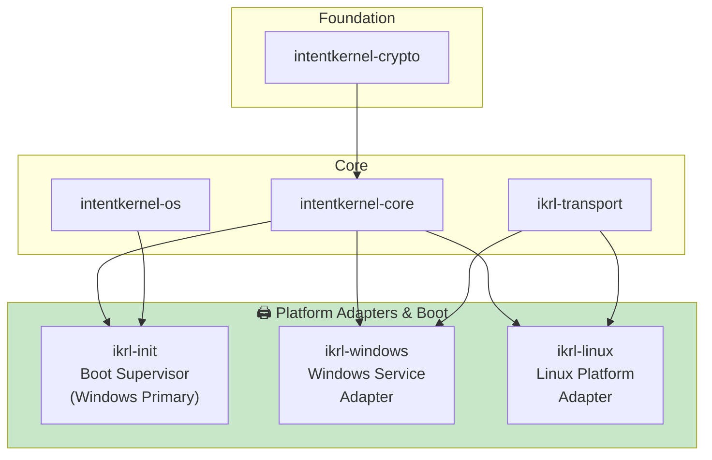
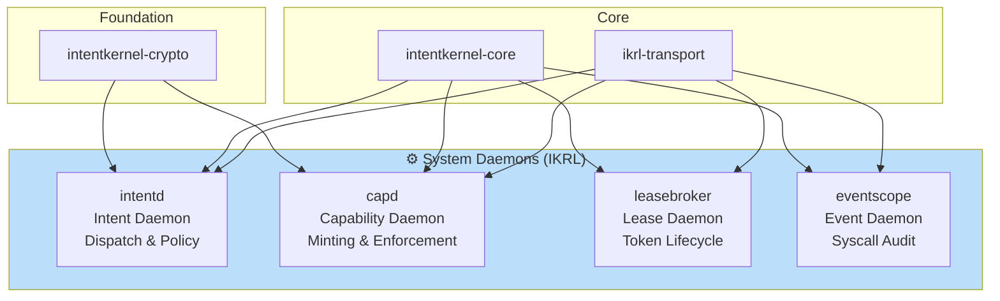
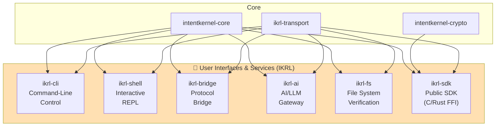
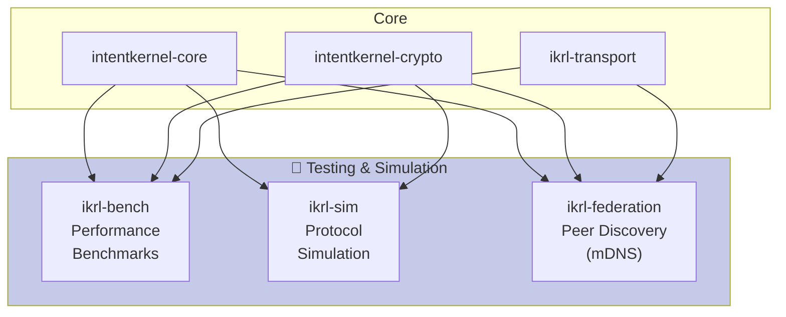

# Dependency Visualizations

## Layer 0: Foundation (No Internal Dependencies)



## Layer 1: Core Types & Protocol



## Layer 2a: IntentOS System



## Layer 2b: IKRL Platform Adapters & Init



## Layer 2c: IKRL System Daemons



## Layer 2d: IKRL User Interfaces & Services



## Layer 2e: IKRL Testing & Simulation



## Full Dependency Graph: IntentOS + IKRL

```mermaid
graph TB
    subgraph Layer0["Layer 0: Foundation (No Internal Deps)"]
        crypto["🔐 intentkernel-crypto"]
        audit["📋 intentos-audit"]
        hal["🖥️ intentos-hal"]
    end
    
    subgraph Layer1["Layer 1: Core Types & Protocol"]
        core["🔧 intentkernel-core"]
        os["🏗️ intentkernel-os"]
        transport["🌐 ikrl-transport"]
    end
    
    subgraph IntentOSKernel["intentos-kernel (TIER-3)"]
        kernel["kernel"]
    end
    
    subgraph IntentOSUtils["intentos-utilities (TIER-1)"]
        utilities["utilities"]
    end
    
    subgraph IntentOSShell["intentos-shell (TIER-2)"]
        shell["shell"]
    end
    
    subgraph IntentOSBench["intentos-bench"]
        bench["bench"]
    end
    
    subgraph IKRLPlatform["IKRL Platform"]
        init["ikrl-init"]
        windows["ikrl-windows"]
        linux["ikrl-linux"]
    end
    
    subgraph IKRLDaemons["IKRL Daemons"]
        intentd["intentd"]
        capd["capd"]
        leasebroker["leasebroker"]
        eventscope["eventscope"]
    end
    
    subgraph IKRLServices["IKRL Services"]
        cli["ikrl-cli"]
        ikrl_shell["ikrl-shell"]
        bridge["ikrl-bridge"]
        ai["ikrl-ai"]
        fs["ikrl-fs"]
        sdk["ikrl-sdk"]
    end
    
    subgraph IKRLTest["IKRL Testing"]
        ikrl_bench["ikrl-bench"]
        sim["ikrl-sim"]
        federation["ikrl-federation"]
    end
    
    subgraph App["Application"]
        intentos["🌟 intentos (main binary)"]
        ransomware["ransomware-demo"]
    end
    
    %% Layer 0 → Layer 1
    crypto --> core
    crypto --> os
    crypto --> transport
    audit --> core
    
    %% Layer 1 → IntentOS
    crypto --> kernel
    audit --> kernel
    core --> kernel
    
    core --> utilities
    hal --> utilities
    audit --> utilities
    
    core --> shell
    kernel --> shell
    utilities --> shell
    
    kernel --> bench
    utilities --> bench
    audit --> bench
    hal --> bench
    
    %% Layer 1 → IKRL Platform
    core --> init
    os --> init
    
    core --> windows
    transport --> windows
    
    core --> linux
    transport --> linux
    
    %% Layer 1 → IKRL Daemons
    core --> intentd
    crypto --> intentd
    transport --> intentd
    
    core --> capd
    crypto --> capd
    transport --> capd
    
    core --> leasebroker
    transport --> leasebroker
    
    core --> eventscope
    transport --> eventscope
    
    %% Layer 1 → IKRL Services
    core --> cli
    transport --> cli
    
    core --> ikrl_shell
    os --> ikrl_shell
    transport --> ikrl_shell
    
    core --> bridge
    transport --> bridge
    
    core --> ai
    transport --> ai
    
    core --> fs
    transport --> fs
    
    core --> sdk
    crypto --> sdk
    transport --> sdk
    
    %% Layer 1 → IKRL Testing
    core --> ikrl_bench
    crypto --> ikrl_bench
    transport --> ikrl_bench
    
    core --> sim
    crypto --> sim
    
    core --> federation
    crypto --> federation
    transport --> federation
    
    %% → Application
    kernel --> intentos
    utilities --> intentos
    shell --> intentos
    
    core --> ransomware
    crypto --> ransomware
    
    style crypto fill:#e1f5ff,stroke:#01579b
    style audit fill:#e1f5ff,stroke:#01579b
    style hal fill:#e1f5ff,stroke:#01579b
    
    style core fill:#fff3e0,stroke:#e65100
    style os fill:#fff3e0,stroke:#e65100
    style transport fill:#fff3e0,stroke:#e65100
    
    style kernel fill:#f3e5f5,stroke:#4a148c
    style utilities fill:#f3e5f5,stroke:#4a148c
    style shell fill:#f3e5f5,stroke:#4a148c
    style bench fill:#f3e5f5,stroke:#4a148c
    
    style intentos fill:#e1bee7,stroke:#7b1fa2,stroke-width:3px
    
    style init fill:#c8e6c9,stroke:#1b5e20
    style windows fill:#c8e6c9,stroke:#1b5e20
    style linux fill:#c8e6c9,stroke:#1b5e20
    
    style intentd fill:#bbdefb,stroke:#0d47a1
    style capd fill:#bbdefb,stroke:#0d47a1
    style leasebroker fill:#bbdefb,stroke:#0d47a1
    style eventscope fill:#bbdefb,stroke:#0d47a1
    
    style cli fill:#ffe0b2,stroke:#e65100
    style ikrl_shell fill:#ffe0b2,stroke:#e65100
    style bridge fill:#ffe0b2,stroke:#e65100
    style ai fill:#ffe0b2,stroke:#e65100
    style fs fill:#ffe0b2,stroke:#e65100
    style sdk fill:#ffe0b2,stroke:#e65100
    
    style ikrl_bench fill:#c5cae9,stroke:#3949ab
    style sim fill:#c5cae9,stroke:#3949ab
    style federation fill:#c5cae9,stroke:#3949ab
    
    style ransomware fill:#ffccbc,stroke:#bf360c
```



## Dependency Complexity: Critical Paths

### IntentOS Boot Chain

```
intentos (main)
  └─→ intentos-utilities (TIER-1)
      ├─→ intentos-kernel (TIER-3)
      │   ├─→ intentos-audit
      │   └─→ ed25519-dalek
      ├─→ intentos-hal
      └─→ reqwest, ldap3
  
  └─→ intentos-shell (TIER-2)
      ├─→ intentos-kernel
      ├─→ intentos-utilities
      └─→ intentos-bench
          └─→ [all above]
```

### IKRL Daemon Bootstrap

```
ikrl-init (supervisor)
  └─→ intentkernel-os
  └─→ intentkernel-core
      └─→ intentkernel-crypto
          └─→ ed25519-dalek, sha3

intentd (intent daemon)
  ├─→ intentkernel-core
  ├─→ intentkernel-crypto
  └─→ ikrl-transport
      └─→ tokio

capd (capability daemon)
  ├─→ intentkernel-core
  ├─→ intentkernel-crypto
  └─→ ikrl-transport

leasebroker (lease daemon)
  ├─→ intentkernel-core
  └─→ ikrl-transport

eventscope (event daemon)
  ├─→ intentkernel-core
  └─→ ikrl-transport
```

## Crate Dependency Statistics

| Metric | Value |
|--------|-------|
| Total Crates | 28 |
| Layer 0 (Foundation) | 3 |
| Layer 1 (Core) | 3 |
| Layer 2 (Systems) | 19 |
| Layer 3 (Demo/Test) | 3 |
| Max Dependency Depth | 4 |
| Crates with No Internal Deps | 3 |
| Crates with 1+ Internal Deps | 25 |
| Binary Targets | 18 |
| Library Targets | 15 |
| Platform-Specific Crates | 3 (ikrl-init, ikrl-windows, ikrl-linux) |

## Workspace Dependency Management

### Shared External Dependencies

All crates use workspace-managed versions:

```toml
[workspace.dependencies]
tokio = { version = "1.x", features = ["full"] }
serde = { version = "1.0" }
serde_json = "1.0"
ed25519-dalek = "2.1"
sha3 = "0.10"
thiserror = "1.0"
anyhow = "1.0"
```

### Internal Dependencies

All use relative paths:
```toml
[dependencies]
intentkernel-core = { workspace = true }     # or { path = "../intentkernel-core" }
intentos-kernel = { path = "../intentos-kernel" }
```

---

## Color Legend

| Color | Layer | Purpose |
|-------|-------|---------|
| 🔵 Light Blue | Layer 0 | Foundation (Cryptography, Audit, HAL) |
| 🟠 Light Orange | Layer 1 | Core Types & Protocol |
| 🟣 Light Purple | Layer 2 | IntentOS System |
| 🟢 Light Green | Layer 2 | IKRL Platform Adapters |
| 🔵 Light Blue (darker) | Layer 2 | IKRL Daemons |
| 🟠 Light Orange (dark) | Layer 2 | IKRL Services |
| 🟣 Light Indigo | Layer 2 | IKRL Testing |
| 🌟 Magenta | Layer 3 | Main Application |

