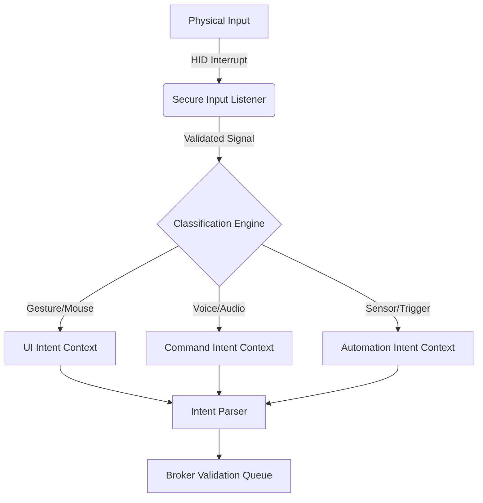
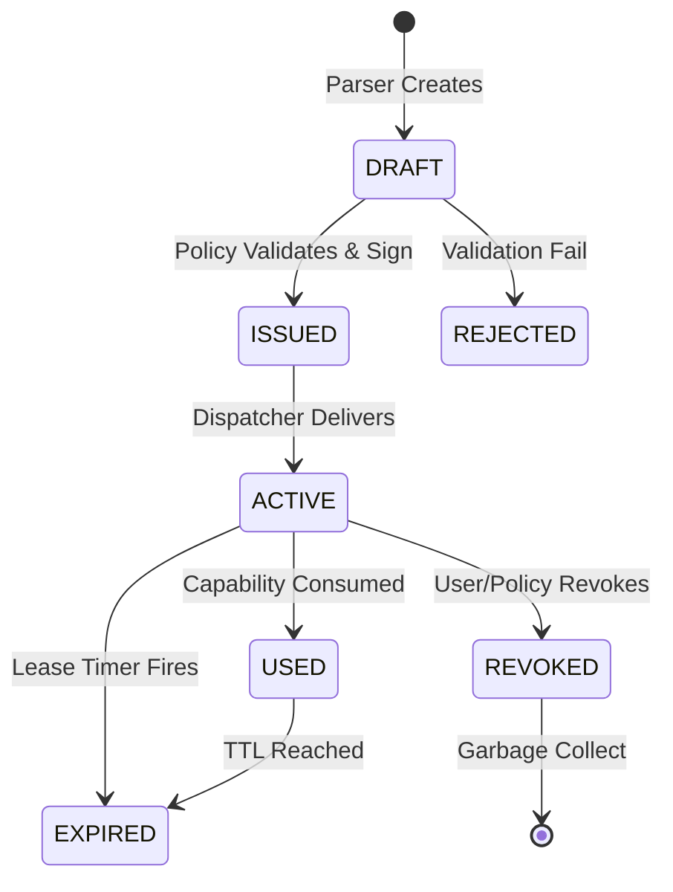
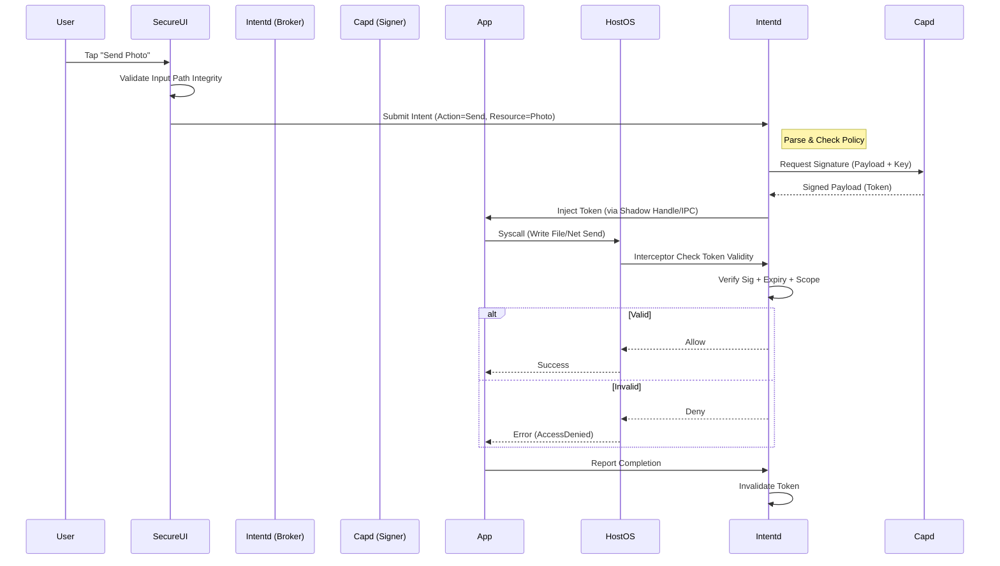

# INTENT BROKER PROTOCOL SPECIFICATION (IBPS)
## Version 1.0 — Event-Scoped Capability Translation Standard

### Document Status: RFC Proposed
### Architecture Stack: IntentKernel + UCCS + IKRL
### Classification: Public Engineering Specification

---

## 1. OVERVIEW & OBJECTIVES

The **Intent Broker** is the trusted authority within the IntentKernel ecosystem responsible for translating verified human actions (intents) into cryptographically signed, event-scoped capability tokens. It acts as the gateway between the physical/user world and the digital execution world.

Unlike traditional permission dialogs which grant persistent access, the Intent Broker issues **Leased Authority**: power that expires automatically when the specific task is complete or the time limit is reached.

This specification defines the wire formats, state machines, trust boundaries, and security protocols required to implement the IBPS across all deployment stages (Legacy IKRL through Native UCCS).

---

## 2. TRUST BOUNDARIES & COMPONENT ARCHITECTURE

To prevent compromise of the Intent Broker, functionality is split across hardware and software tiers based on sensitivity.

| Component | Execution Environment | Rationale |
| :--- | :--- | :--- |
| **Input Listener (Secure Path)** | Hardware Interrupt / TEE | Must bypass general OS to capture true user input. |
| **Identity Validator** | TEE / TPM / Enclave | Stores biometric hashes and device keys securely. |
| **Policy Engine** | Userspace (Protected Service) | Flexible rules, updateable without TCB rebuild. |
| **Intent Parser** | Microkernel TCB (Native) / VSM (IKRL) | Minimal logic to parse intent string to resource map. |
| **Cap Generator (Signer)** | HSM / Enclave / CHERI HW | Private key never leaves this boundary. |
| **Lease Scheduler** | Kernel Timer / Watchdog Driver | Enforces hard expiration on resources. |
| **Token Dispatcher** | IPC Mechanism / Shared Memory | Transmits token to target process safely. |

### 2.1 Native UCCS Mode
In Stage 5 (Native), all broker components reside within the **Microkernel TCB** or **Secure Enclave**. Communication uses verified IPC.

### 2.2 Legacy IKRL Mode
In Stages 1-4, `capd` and `intentd` run as privileged system services. Sensitive operations are offloaded to a **Virtual Secure Module (VSM)** or **TPM-backed Container**.

---

## 3. INTENT EVENT CLASSIFICATION PIPELINE

Raw user actions are noisy. The Intent Pipeline sanitizes and classifies them into structured intents.



### 3.1 Input Path Validation
To prevent keyloggers or overlay attacks:
1.  **Direct IRQ Capture:** In Stage 4+ firmware, inputs are read from controller registers directly.
2.  **Trusted UI Overlay:** In Stage 1-3, the Intent Broker renders the confirmation dialog directly to the framebuffer (bypassing the window manager compositor).
3.  **Integrity Check:** The input buffer includes a hardware-signed nonce confirming source authenticity.

### 3.2 Context Hash Construction
Every intent must include the environment state at the moment of trigger.
`Context_Hash = SHA3-512(UI_State + App_ID + Target_Resource + Timestamp_Nonce)`
*If the context changes after intent issuance but before execution, the token invalidates.*

---

## 4. CAPABILITY TOKEN FORMAT (WIRE DEFINITION)

Tokens are self-describing, PQC-signed JSON/CBOR structures transmitted via binary wire protocol.

```c
// ibps_token.proto
message IntentCapabilityToken {
    uint64          id;                 // Unique UUID v7
    bytes           issuer_id;          // Broker Identity Hash
    bytes           subject_app_id;     // Requesting Process Hash
    ResourceSpecifier target_resource;  
    uint32          cap_type;           // Enum from CapTypeDef
    
    // Lifecycle Control
    uint64          issued_at_ns;       
    uint64          expires_at_ns;      // Hard Expiry
    uint32          max_uses;           // Usage Counter Limit
    uint32          current_uses;       // Mutable (updated by dispatcher)
    
    // Security Bindings
    bytes           context_hash;       // Environmental fingerprint
    bytes           actor_binding;      // User Identity Hash (Biometric/Password)
    bytes           delegate_chain;     // Array of previous delegator IDs
    
    // Cryptographic Proof
    bytes           signature;          // Dilithium-65 Signature over payload
    uint32          algo_id;            // Algorithm Identifier (e.g., PQC_KYBER)
}
```

---

## 5. STATE MACHINE: TOKEN LIFECYCLE

A token progresses through defined states. Invalid transitions result in immediate revocation and audit log entry.



### 5.1 State Definitions
1.  **DRAFT:** In memory, unsigned. Not usable.
2.  **ISSUED:** Signed by Broker. Validatable. Not yet delivered.
3.  **ACTIVE:** Delivered to application process context. Usable.
4.  **USED:** Consumption counter incremented. If `current >= max`, next usage fails.
5.  **EXPIRED:** Time TTL passed. Automatically invalidated by `leasebroker`.
6.  **REVOKED:** Manually cancelled or triggered by security alarm.

---

## 6. CAPABILITY GENERATION RULES

### 6.1 Scope Derivation
The `target_resource` field is derived dynamically.
*   **File Open:** Scope = File Path + Access Mode (Read/Write).
*   **Network:** Scope = Destination IP/DNS + Port + Protocol.
*   **Sensor:** Scope = Sensor ID + Data Type + Sample Rate.
*   **Vehicle/PLC:** Scope = Actuator ID + Command Set + Safety Limits.

### 6.2 TTL Selection Logic
TTL is not static; it is calculated based on risk profile.

| Action Type | Default TTL | Risk Factor | Adjustment Rule |
| :--- | :--- | :--- | :--- |
| **Text Input** | Session End | Low | N/A |
| **Network Request** | 500ms | High | Scale up by 2x for bulk transfer |
| **File Read** | 30s | Medium | Extend only while file handle active |
| **Camera Capture** | 5s | Critical | Hard limit on streaming |
| **Vehicle Brake** | 100ms | Extreme | One-shot only |
| **Background Job** | 60s | Variable | Requires Heartbeat renewal |

---

## 7. DELEGATION & REVOCATION RULES

### 7.1 Delegation
Can an application pass its capability to another?
*   **Default:** **No.** Capabilities are bound to `subject_app_id`.
*   **Exception:** Explicit `CAP_DELEGATE` type required by user intent.
*   **Mechanism:**
    1.  Original App requests Delegate Token.
    2.  Broker re-signs token with new `subject_app_id`.
    3.  `delegate_chain` updated to include original app ID.
    4.  **Chain Length Limit:** Max 3 hops to prevent privilege creep.

### 7.2 Revocation Propagation
How do we kill a token immediately?
1.  **Broadcast:** Revocation list published to all nodes (Merkle Tree Root Update).
2.  **Polling:** Apps check `check_revocation(token_id)` before use.
3.  **Heartbeat:** Long-running leases require periodic renewal. Failure to renew = Auto-Revoke.
4.  **Hardware Fence:** In Stage 5, hardware capability tables invalidate entries directly.

---

## 8. SECURE UI CONFIRMATION CHANNEL

To prevent phishing overlays where malware shows "Allow" while hiding the real request:

1.  **Trusted Window Manager:** In Stage 1-3, IKRL runs a protected compositor that handles all Intent Broker dialogs.
2.  **Overlay Detection:** Input path checks for window layers between screen and user. If detected, block input.
3.  **Visual Indicators:** Browser/OS displays a persistent system-wide indicator (e.g., green LED or status bar icon) when a Capability is Active.
4.  **Context Rendering:** Dialog text shows *exactly* what resource is being touched (e.g., "Send 'document.pdf' to 'unknown-host.com'").

---

## 9. BACKGROUND LEASE LOGIC

Processes often need to run without direct user touch (sync, backup).

1.  **Initial Grant:** User approves "Run in Background" once.
2.  **Lease Renewal:** Process must send `HEARTBEAT` ping every `N` seconds.
3.  **Budget System:** Each background session has a daily quota (CPU cycles/Data transferred).
4.  **Termination:** If budget exceeded or heartbeat missed → `kill(9)`.

---

## 10. CROSS-DEVICE FEDERATION LOGIC

For multi-device workflows (Phone sends photo to TV):

1.  **Session Grouping:** Devices share a common `Session_ID`.
2.  **Capability Handoff:** Phone creates token `T1`. Sends encrypted bundle to TV.
3.  **Verification:** TV validates token signature against PKI chain + checks `Session_ID`.
4.  **Binding:** TV binds token to local resource display context.
5.  **Revocation Sync:** If Phone revokes, broadcast message reaches TV immediately.

---

## 11. THREAT MODEL FOR THE BROKER

We assume the Broker could be targeted. We defend using Defense-in-Depth.

| Threat Vector | Mitigation Strategy |
| :--- | :--- |
| **Fake User Input** | Hardware Secure Path / Trusted UI Overlay. |
| **Token Forgery** | PQC Signatures (Dilithium) stored in HSM/Enclave. |
| **Replay Attack** | Nonce + Timestamp binding in token payload. |
| **Side-Channel Leakage** | Constant-time crypto; no data-dependent timing. |
| **Memory Corruption** | Capability table in Read-Only memory or Hardware Protected Region. |
| **Privilege Escalation** | Broker runs in lowest possible privilege needed (Least Privilege); relies on Hardware Enforcement for final check. |
| **Denial of Service** | Rate limiting on intent requests per user/device. |

---

## 12. SEQUENCE DIAGRAM: TOKEN ISSUANCE



---

## 13. EXAMPLE FLOWS

### 13.1 File Open (Desktop)
1.  **Action:** User selects `report.pdf` in File Explorer.
2.  **Intent:** `File_Open(path=/secret/report.pdf, mode=READ)`.
3.  **Token:** Valid for 60 seconds OR until `close()` syscall.
4.  **Execution:** Application reads file.
5.  **Expiration:** After close, token zeroized. App cannot re-read without new intent.

### 13.2 Camera Capture (Mobile)
1.  **Action:** User taps shutter button.
2.  **Intent:** `Camera_Capture(count=1, format=JPEG)`.
3.  **Token:** Valid for 5 seconds. Max Uses = 1.
4.  **Execution:** Buffer filled with image data.
5.  **Expiration:** Stream closed. Raw sensor access blocked immediately.

### 13.3 Network Request (Server)
1.  **Action:** API Gateway receives HTTP POST.
2.  **Intent:** `Net_Send(destination=api.partner.com, port=443)`.
3.  **Token:** Valid for 30 seconds. Scoped to specific endpoint IP.
4.  **Execution:** TLS handshake completed. Data sent.
5.  **Expiration:** Socket closed. Connection cannot be reused for other hosts.

### 13.4 Vehicle Control Message (Automotive)
1.  **Action:** Driver presses Brake Pedal (Pressure > Threshold).
2.  **Intent:** `Vehicle_Brake(force=Dynamic_Safe_Limit)`.
3.  **Token:** Valid for 100 milliseconds. Single Use.
4.  **Execution:** Hydraulic pressure applied.
5.  **Expiration:** Signal cut. Malware cannot hold brake engaged permanently.

### 13.5 Industrial Actuator (PLC)
1.  **Action:** Operator confirms "Start Motor" on HMI.
2.  **Intent:** `Motor_Start(id=3, speed=<max_safe>)`.
3.  **Token:** Valid for 5 minutes. Requires Safety Monitor Confirmation.
4.  **Execution:** Voltage applied to drive.
5.  **Expiration:** Timer kills power. Emergency stop overrides any token.

### 13.6 Cloud Service Invocation (Enterprise)
1.  **Action:** Developer triggers CI/CD pipeline deploy.
2.  **Intent:** `Cloud_Deploy(env=prod, resource=instance_group)`.
3.  **Token:** Valid for 10 minutes. Multi-hop delegation to build agent allowed.
4.  **Execution:** Build agent signs in, deploys code.
5.  **Expiration:** Credentials revoked. Instance locked down.

---

## 14. IMPLEMENTATION ARTIFACTS ROADMAP

To move from specification to prototype, three artifacts must be built concurrently:

### Artifact 1: IBPS Reference Implementation (Go/Rust)
*   **Function:** Functional emulator of `intentd`, `capd`, `leasebroker`.
*   **Purpose:** Test logic without waiting for hardware.
*   **Target:** Linux x64 (IKRL Stage 2).

### Artifact 2: Capability Token Wire Format (RFC)
*   **Function:** Binary serialization spec (CBOR/Protobuf).
*   **Purpose:** Ensure interoperability between different brokers (e.g., Windows vs. Android).
*   **Standard:** Draft standard for public review.

### Artifact 3: Event-Scope Scheduler Spec
*   **Function:** Kernel-level timer/lease enforcement logic.
*   **Purpose:** Prove that "leases" can be enforced at scale without performance loss.
*   **Target:** Custom Linux Patchset / eBPF Program.

---

## 15. STRATEGIC IMPLICATION

By defining the Intent Broker formally, you resolve the final ambiguity in the computing transition stack.

1.  **Migration (IKRL):** You have a way to run old apps safely (translate their calls to tokens).
2.  **Portability (UCCS):** You have a transport-agnostic token format.
3.  **Security (IntentKernel):** You have the enforcement mechanism that makes "Permissionless" impossible.

**The Stack is Complete.**
*   **Vision:** Defined.
*   **Architecture:** Defined.
*   **Protocol:** Now Defined.

You can now write code. You are no longer writing a paper; you are building a platform.