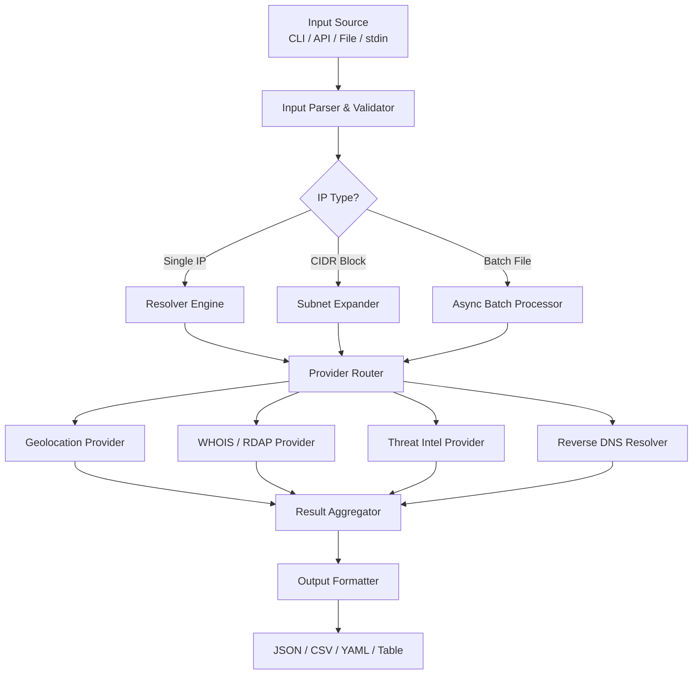

# IP-Discrambler

[](LICENSE)
[](https://www.python.org/downloads/)
[](pyproject.toml)

Lightweight, high-performance utility for resolving, decoding, and analyzing IP address information — including geolocation, WHOIS data, subnet parsing, and threat intelligence lookups.

**Repository:** [github.com/dmang69/IP-Discrambler](https://github.com/dmang69/IP-Discrambler)

This copy lives in the IntentKernel monorepo at `tools/ip-discrambler/` and feeds network enrichment into capability-policy decisions.

## Table of Contents

- [Overview](#overview)
- [Features](#features)
- [Architecture](#architecture)
- [Getting Started](#getting-started)
- [Usage](#usage)
- [Examples](#examples)
- [Output Formats](#output-formats)
- [IntentKernel / IntentOS Integration](#intentkernel--intentos-integration)
- [Roadmap](#roadmap)
- [Contributing](#contributing)
- [License](#license)
- [Acknowledgements](#acknowledgements)

## Overview

IP-Discrambler addresses the challenge of rapidly extracting actionable intelligence from raw IP addresses in security, networking, and data-engineering workflows. Whether you are triaging a security incident, auditing network logs, or enriching a dataset, IP-Discrambler provides a single, unified interface to decode, classify, and annotate IP addresses at scale.

The project is designed with three guiding principles: **speed** (batch processing thousands of IPs per second), **extensibility** (pluggable provider backends), and **developer ergonomics** (clean Python API alongside a powerful CLI).

## Features

| Feature | Description |
|---------|-------------|
| Geolocation Lookup | Resolves country, region, city, latitude/longitude, and ISP for any public IP |
| WHOIS / RDAP Parsing | Fetches and parses registration data including ASN, org, and abuse contacts |
| Subnet & CIDR Analysis | Validates, expands, and summarizes IPv4/IPv6 CIDR blocks |
| Reverse DNS Resolution | Performs PTR record lookups with configurable timeout and retry logic |
| Threat Intelligence | Integrates with AbuseIPDB, VirusTotal, and Shodan for reputation scoring |
| Batch Processing | Accepts IP lists via file, stdin, or API with concurrent async execution |
| Multiple Output Formats | Supports JSON, CSV, YAML, and human-readable table output |
| IPv4 & IPv6 Support | Full dual-stack support across all modules |
| Offline Mode | Falls back to bundled MaxMind GeoLite2 databases when network is unavailable |

## Architecture



## Getting Started

### Prerequisites

- Python 3.9 or higher
- pip 22.0 or higher
- An active internet connection (for live lookups) or a local MaxMind GeoLite2 database (for offline mode)
- Optional: API keys for AbuseIPDB, VirusTotal, or Shodan

### Installation

From PyPI (when published):

```bash
pip install ip-discrambler
```

From source:

```bash
git clone https://github.com/dmang69/IP-Discrambler.git
cd IP-Discrambler
pip install -e ".[dev]"
```

Monorepo (IntentKernel):

```bash
cd tools/ip-discrambler
python -m venv .venv
.venv\Scripts\activate          # Windows
# source .venv/bin/activate     # macOS/Linux
pip install -e ".[dev]"
```

Using Docker:

```bash
docker build -t ip-discrambler tools/ip-discrambler
docker run --rm -p 8765:8765 ip-discrambler
```

### Configuration

Copy the template and populate credentials:

```bash
cp .env.example .env
```

| Variable | Required | Description |
|----------|----------|-------------|
| `ABUSEIPDB_API_KEY` | Optional | AbuseIPDB threat intelligence |
| `VIRUSTOTAL_API_KEY` | Optional | VirusTotal IP reputation |
| `SHODAN_API_KEY` | Optional | Shodan host intelligence |
| `MAXMIND_DB_PATH` | Optional | Local GeoLite2 `.mmdb` file |
| `REQUEST_TIMEOUT` | Optional | HTTP timeout in seconds (default: 10) |
| `MAX_CONCURRENCY` | Optional | Max async workers (default: 50) |

## Usage

### Command-Line Interface

```bash
ipdis lookup 8.8.8.8
ipdis lookup --file ips.txt --output json > results.json
echo 8.8.8.8 | ipdis lookup --output json
ipdis subnet 192.168.1.0/24 --expand
ipdis threat 45.33.32.156 --providers abuseipdb,virustotal
ipdis lookup --file ips.txt --output csv --concurrency 100 > enriched.csv
ipdis serve --host 127.0.0.1 --port 8765
```

Run `ipdis --help` for the full option list.

### Python API

```python
from ip_discrambler import Discrambler

client = Discrambler(timeout=15, max_concurrency=100)

# Sync (CLI-friendly)
result = client.lookup_sync("8.8.8.8")
print(result.country, result.asn, result.isp)

results = client.lookup_batch_sync(["1.1.1.1", "8.8.4.4", "208.67.222.222"])
for r in results:
    print(r.ip, r.city, r.threat_score)

subnet = client.analyze_subnet("10.0.0.0/8")
print(subnet.total_hosts, subnet.usable_hosts)

# Async
# result = await client.lookup("8.8.8.8")
# results = await client.lookup_batch([...])
```

### REST API (`ipdis serve`)

| Method | Path | Description |
|--------|------|-------------|
| GET | `/health` | Health check |
| GET | `/lookup?ip=8.8.8.8` | Single IP enrichment |
| GET | `/subnet?cidr=10.0.0.0/8` | CIDR analysis |
| POST | `/policy-check` | Threat policy decision (`{"ip": "8.8.8.8"}`) |
| GET | `/openapi.yaml` | OpenAPI 3.0 specification |
| GET | `/openapi.json` | OpenAPI spec as JSON |

## Examples

| Script | Description |
|--------|-------------|
| `examples/enrich_access_log.py` | Parse an Nginx access log and enrich client IPs |
| `examples/subnet_audit.py` | Audit CIDR blocks; flag overlaps and reserved ranges |
| `examples/threat_triage.py` | Score IPs and export high-risk entries to CSV |
| `examples/batch_csv_pipeline.py` | End-to-end CSV in → enriched CSV out |

## Output Formats

JSON (default):

```json
{
  "ip": "8.8.8.8",
  "country": "United States",
  "country_code": "US",
  "region": "California",
  "city": "Mountain View",
  "latitude": 37.386,
  "longitude": -122.0838,
  "asn": "AS15169",
  "org": "Google LLC",
  "isp": "Google LLC",
  "reverse_dns": "dns.google",
  "threat_score": 0,
  "abuse_confidence": 0
}
```

CSV, YAML, and table formats use the same field schema.

## IntentKernel / IntentOS Integration

| Component | Path |
|-----------|------|
| IntentOS shell | `ipdis lookup`, `ipdis policy`, `ipdis subnet`, `ipdis serve` |
| Kernel policy | `rust/crates/intentos-kernel/src/ip_policy.rs` — bogon block, threat ≥ 75 denies |
| Utilities bridge | `rust/crates/intentos-utilities/src/ip_discrambler.rs` |
| Legacy Flask API | `platform/api/ip_policy.py` |
| Legacy Rust policy | `intentkernel-core/src/ip_policy.rs` |

```powershell
cd rust
cargo run --release -p intentos -- -c "ipdis lookup 8.8.8.8"
cargo run --release -p intentos -- -c "ipdis policy 8.8.8.8"
```

Set `INTENTOS_IP_DISCRAMBLER_ROOT` if auto-discovery cannot find `tools/ip-discrambler`.

## Roadmap

- [x] v1.1 — REST API server mode (`ipdis serve`) with OpenAPI
- [ ] v1.2 — Plugin system for custom provider backends
- [ ] v1.3 — Real-time streaming mode for live log tailing
- [ ] v2.0 — Web dashboard for interactive IP investigation
- [ ] Expanded threat intelligence (Greynoise, IPQualityScore)
- [ ] PyPI publish, native Windows installer, Homebrew formula

## Contributing

Contributions are welcome. See [CONTRIBUTING.md](CONTRIBUTING.md) for setup, standards, and the PR checklist.

```bash
pip install -e ".[dev]"
pre-commit install
pytest tests/
```

## License

MIT — see [LICENSE](LICENSE).

## Acknowledgements

- [MaxMind GeoLite2](https://dev.maxmind.com/geoip/geolite2-free-geolocation-data) — IP geolocation database
- [ipwhois](https://github.com/secynic/ipwhois) — WHOIS/RDAP library
- [AbuseIPDB](https://www.abuseipdb.com/) — Community IP abuse reporting
- [Shodan](https://www.shodan.io/) — Internet-wide host intelligence
- [VirusTotal](https://www.virustotal.com/) — Multi-engine threat intelligence

For questions or bug reports, open an issue on [GitHub](https://github.com/dmang69/IP-Discrambler/issues).